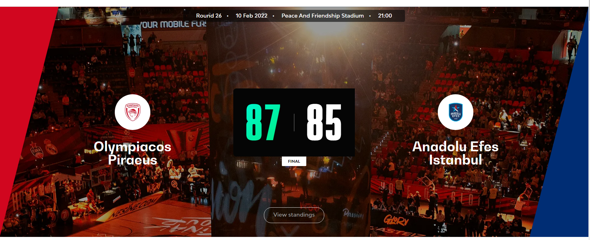

# Baskeball match simulator

This simulator show the simple basketball game website monitoring.

The goal was to learn more about NodeJs, backend + frontend and connect it together by API.

It has two main parts:
1. Backend server- it serves API of a game.
2. Frontend website- that renders backend data.

# FRONTEND

Run file:

- in current directory open new terminal and write in console
 
 > npm i -D dead-server

 > npm run dev

This will start live server at port 3000 where browser renders basketball game website.

 # BACKEND

It runs on it's own server at `http://localhost:3001`

 Run file:

- in current directory open new terminal and write in console

 > npm i express

 > npm i --save-dev nodemon

 > npm i cors

 > npm run start